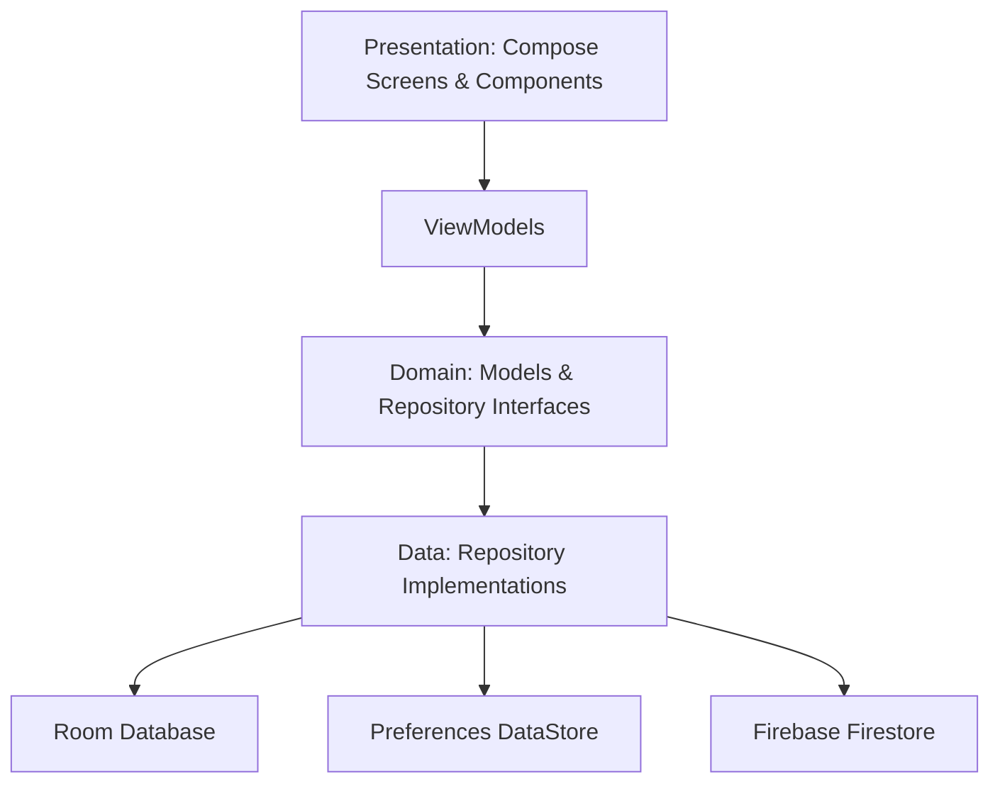

# 📱 Storentry

### Premium offline-first inventory management for local shops

Storentry is a fast, polished Android inventory app built for local shop owners, micro-vendors, and small retail teams who need stock updates to feel effortless.

It is designed around one simple promise:

> **Tap tap, done.**

The app works offline first, stores inventory locally with Room, supports quick stock changes, highlights low-stock products, and includes modern Android foundations like Jetpack Compose, Hilt, WorkManager, Firebase backup, and RevenueCat-powered premium flows.

<br />

<p align="center">
  
  
  
  
</p>

<br />

---

## ✨ Why Storentry?

Storentry is made for speed, clarity, and reliability in real shop environments.

| Focus | What it means |
| :--- | :--- |
| ⚡ **Fast** | Quick product entry and stock updates in as few taps as possible. |
| 📶 **Offline-first** | Inventory stays usable even with weak or missing internet. |
| 🇮🇳 **Local-shop friendly** | Indian Rupee support and simple terminology for shop workflows. |
| 💎 **Premium feel** | Modern Compose UI with the custom Stitch visual style. |

<br />

---

## 🚀 Features

### Inventory

- Add, edit, and manage products
- Track product quantity, category, purchase price, selling price, and low-stock threshold
- Open product details for quick manual stock updates
- Use quick adjust actions for common stock changes

### Alerts

- Detect low-stock products reactively
- Show a dedicated low-stock alerts screen
- Send local notifications for stock that needs attention

### Dashboard

- View total products
- See estimated inventory value
- Review low-stock counts
- Access quick stock update flows

### History

- Track every product and quantity adjustment
- Review stock activity chronologically
- Keep an audit-style ledger of inventory changes

### Reports

- Review inventory value summaries
- See category distribution
- Track stock movement metrics
- Find top products by inventory value

### Premium & Backup

- Google Sign-in with Credential Manager
- Firebase Firestore cloud backup through WorkManager
- RevenueCat paywall for premium features

<br />

---

## 🧱 Architecture

Storentry follows Clean Architecture with a simple MVVM presentation layer.



<br />

### Project Structure

```text
com.shaikh.storentry/
├── data/
│   ├── local/          # Room database, DAO, entities
│   ├── repository/     # Repository implementations
│   ├── sync/           # Cloud sync manager
│   └── worker/         # WorkManager jobs
├── domain/
│   ├── model/          # Business models
│   └── repository/     # Repository contracts
├── presentation/
│   ├── components/     # Reusable Compose components
│   ├── navigation/     # App navigation routes and graph
│   ├── screens/        # Feature screens and ViewModels
│   └── theme/          # Color, typography, theme setup
├── di/                 # Hilt modules
└── utils/              # Helpers, constants, UI state, notifications
```

<br />

---

## 🛠️ Tech Stack

| Category | Technology |
| :--- | :--- |
| Language | Kotlin |
| UI | Jetpack Compose + Material 3 |
| Architecture | Clean Architecture + Simple MVVM |
| Navigation | Navigation Compose |
| Dependency Injection | Hilt |
| Database | Room + KSP |
| Preferences | DataStore |
| Background Work | WorkManager |
| Image Loading | Coil |
| Logging | Timber |
| Auth | Google Credentials / Credential Manager |
| Cloud Sync | Firebase Firestore |
| Premium | RevenueCat |
| Analytics | Firebase Analytics + Crashlytics |

<br />

---

## ⚙️ Getting Started

### Prerequisites

- Android Studio Ladybug `2024.2.1` or newer
- Android SDK 26+
- Java 17+
- A Firebase project, if you want cloud backup enabled
- A RevenueCat API key, if you want premium flows enabled

<br />

### Clone

```bash
git clone https://github.com/shaikhmohammadtalha/android-storentry.git
cd android-storentry
```

<br />

### Firebase Setup

1. Create a Firebase project.
2. Add an Android app with this package name:

```text
com.shaikh.storentry
```

3. Download `google-services.json`.
4. Place it inside the `app/` directory.

> `google-services.json` is ignored by Git so local credentials stay private.

<br />

### RevenueCat Setup

Add your RevenueCat API key locally before using premium subscription features.

```kotlin
buildConfigField(
    "String",
    "REVENUECAT_API_KEY",
    "\"your_revenuecat_api_key_here\""
)
```

<br />

### Run

1. Open the project in Android Studio.
2. Let Gradle sync finish.
3. Run the app on an emulator or Android device.

<br />

---

## 🧭 Current Status

| Area | Status |
| :--- | :--- |
| Home Dashboard | Done |
| Product Management | Done |
| Product Details | Done |
| Low Stock Alerts | Done |
| Activity History | Done |
| Reports & Analytics | Done |
| Google Sign-in | Done |
| Cloud Sync | Done |
| Premium Paywall | Done |
| Barcode Scanner | Upcoming |

<br />

---

## 🎯 Built For

Local Indian shops that need inventory to be:

- quick to update
- available offline
- simple to understand
- reliable during daily shop work

<br />

**Storentry:** the fastest offline inventory app for local Indian shops.
